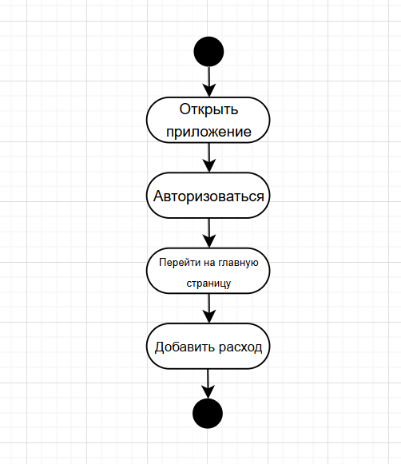
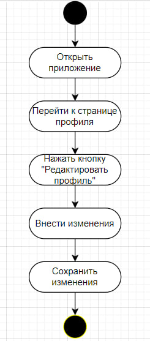

# Диаграмма активностей 
## Содержание 
1. [Регистрация и авторизация](https://github.com/del1ght7/ExpenseWise/blob/main/diagrams/activity.md#1%D1%81%D0%BE%D0%B7%D0%B4%D0%B4%D0%B0%D0%BD%D0%B8%D0%B5-%D0%BD%D0%BE%D0%B2%D0%BE%D0%B3%D0%BE-%D0%BF%D0%BE%D0%BB%D1%8C%D0%B7%D0%BE%D0%B2%D0%B0%D1%82%D0%B5%D0%BB%D1%8F) 
2. [Добавление расхода](https://github.com/del1ght7/ExpenseWise/blob/main/diagrams/activity.md#2-%D0%B4%D0%BE%D0%B1%D0%B0%D0%B2%D0%BB%D0%B5%D0%BD%D0%B8%D0%B5-%D1%80%D0%B0%D1%81%D1%85%D0%BE%D0%B4%D0%B0) 
3. [Редактирование профиля пользователя](https://github.com/del1ght7/ExpenseWise/blob/main/diagrams/activity.md#3-%D1%80%D0%B5%D0%B4%D0%B0%D0%BA%D1%82%D0%B8%D1%80%D0%BE%D0%B2%D0%B0%D0%BD%D0%B8%D0%B5-%D0%BF%D1%80%D0%BE%D1%84%D0%B8%D0%BB%D1%8F-%D0%BF%D0%BE%D0%BB%D1%8C%D0%B7%D0%BE%D0%B2%D0%B0%D1%82%D0%B5%D0%BB%D1%8F) 

## 1. Созддание нового пользователя

## 2. Добавление расхода

## 3. Редактирование профиля пользователя

