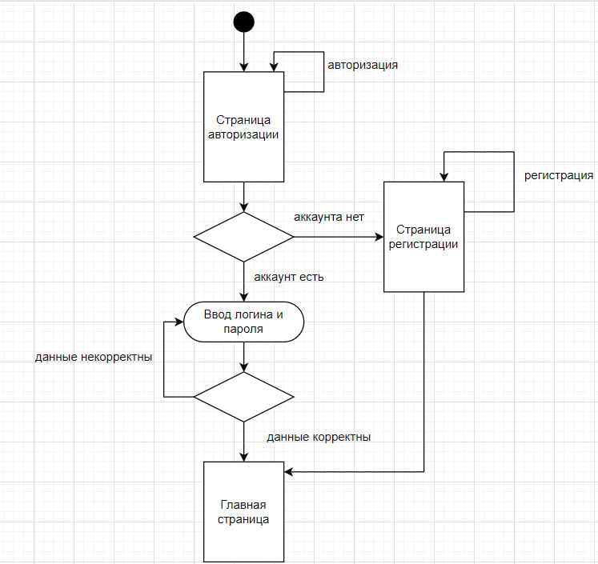
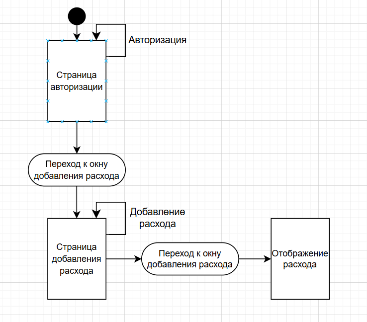
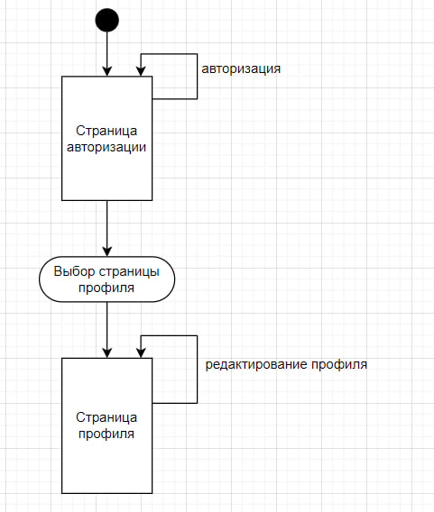

# Диаграмма состояний

## Содержание
1. [Авторизация и регистрация](#1)
2. [Выбор уровня](#2)
3. [Редактирование профиля пользователя](#3)

### 1. Авторизация и регистрация

### 2. Выбор уровня 

### 3. Редактирование профиля пользователя

